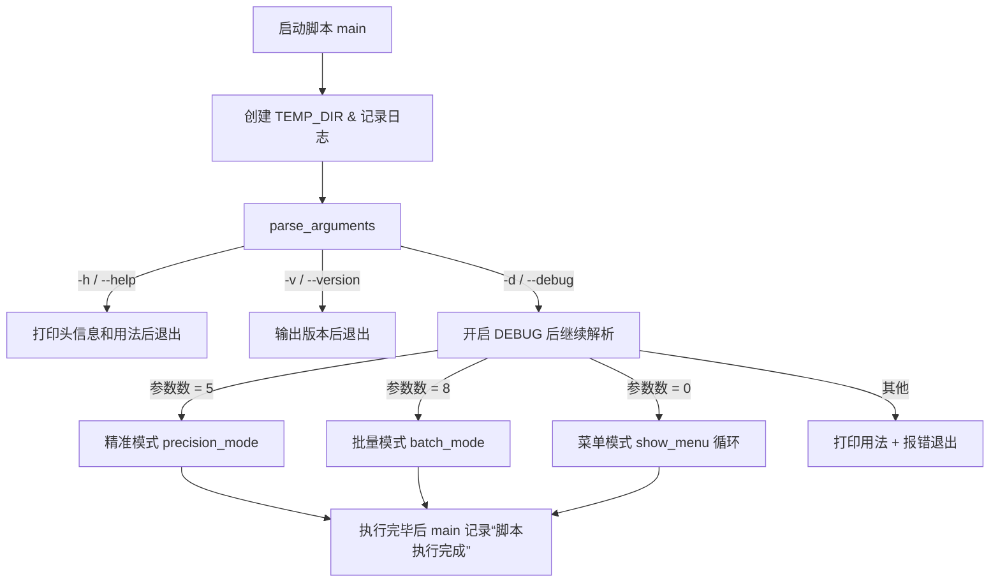
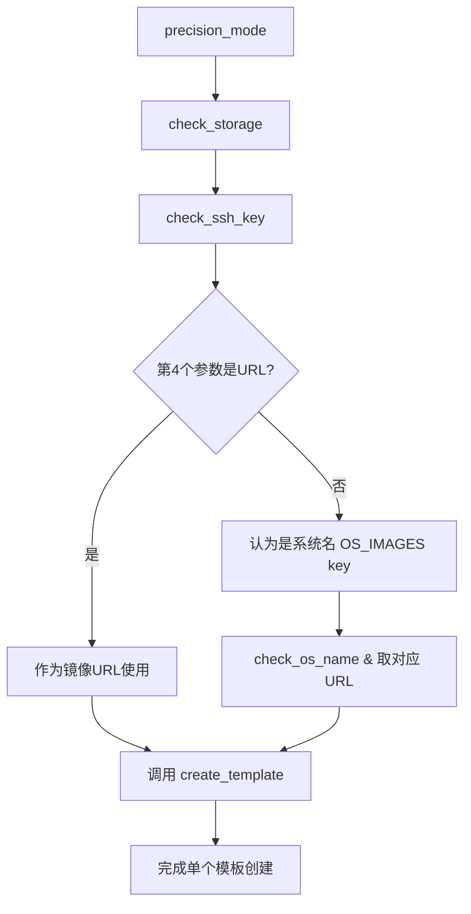
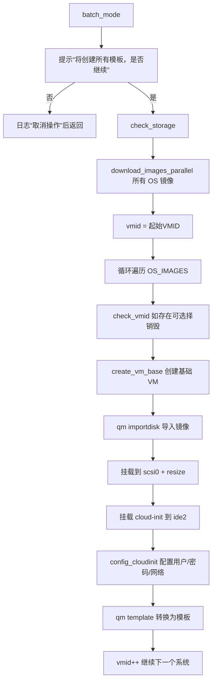

# PVE-template-maker

一组用于在 Proxmox VE 中快速创建云模板的脚本，支持交互式创建、批量一键创建和强化版的自动化模板生成。

- `create-cloud-templates.sh`：新版 / 增强版，一站式云模板创建工具（推荐使用）。
- `pvez.sh`：旧版单模板创建脚本，支持交互或通过参数创建单个模板。
- `templates.sh`：旧版一键批量创建 10 个常见发行版模板的脚本。

## 1. `create-cloud-templates.sh` 逻辑说明

### 1.1 功能概览

- 自动检测并安装缺失依赖（`qm`、`pvesm`、`wget`、`curl`、`guestmount` 等）。
- 根据出口 IP 自动选择国内/国外镜像站（支持华为云、清华、阿里等）。
- 镜像下载支持：本地缓存、断点续传、并行下载、可选 SHA256 校验。

### 1.2 主入口与参数解析流程



在三种模式进入前，会统一执行：

- `check_root`：必须以 root 运行。
- `check_dependencies`：检查并自动安装系统依赖。
- `rewrite_urls OS_IMAGES`：根据出口 IP 自动选择镜像站，重写下载 URL。

### 1.3 精准模式（单模板命令行创建）

调用方式：

```bash
./create-cloud-templates.sh <存储> <网桥> <VMID> <系统名|镜像URL> <公钥路径>
```

流程：



`create_template` 内部会：

- 下载或命中缓存镜像。
- 创建基础 VM (`qm create`)。
- 导入磁盘并挂到 `scsi0`，调整大小。
- 挂载 cloud-init 盘到 `ide2`。
- 调用 `config_cloudinit` 进行用户、密码、网络、SSH 等配置。
- 将 VM 转换为模板 (`qm template`)。

### 1.4 批量模式（一次创建全部模板）

调用方式：

```bash
./create-cloud-templates.sh <存储> <网桥> <起始VMID> <CPU> <内存> <磁盘> <用户> <密码>
```

流程：



批量模式特点：

- 所有镜像先并行下载到临时目录，失败会中断后续创建。
- 从起始 VMID 开始，依次为每个系统分配一个 VMID。
- 可根据提示选择是否销毁已有 VMID。

### 1.5 菜单 / 交互模式

#### 菜单模式（无参数运行）

```bash
./create-cloud-templates.sh
```

选择 1 和 2 会直接调用对应的 `batch_mode` 或 `interactive_mode`。

#### 交互模式（`interactive_mode`）

主要步骤：

- 依次询问：存储池、网桥、CPU、内存、磁盘大小、用户名、密码。
- 可选是否导入 SSH 公钥。
- 列出所有预置系统（`OS_IMAGES` 表），让用户通过序号选择一个。
- 再输入 VMID。
- 调用 `create_template` 按上述流程创建模板。

## 2. `pvez.sh` 逻辑说明（单模板旧版脚本）

### 2.1 用途

- 以交互或参数方式创建单个云模板。
- 适合简单场景：一次只生成一个模板，没有缓存/并行下载等高级功能。

### 2.2 核心流程

两种调用方式：

- 无参数：
	- 进入菜单选择 10 个发行版之一（Debian/Ubuntu/CentOS/Alma/Rocky）。
	- 输入 VMID。
- 带两个参数：

```bash
./pvez.sh <发行版选项(1-10)> <VMID>
```

与新版脚本相比：

- 没有依赖检测与自动安装。
- 没有镜像缓存与镜像站切换。
- 没有深入的 cloud-init 内部配置（只挂载 cloud-init，不改镜像内部文件）。

## 3. `templates.sh` 逻辑说明（一键创建全部模板的旧版脚本）

### 3.1 用途

- 从固定 VMID=8000 开始，一次性创建 10 个预定义发行版的模板。
- 更偏向“全量批量初始化”的场景。

### 3.2 核心流程

运行：

```bash
./templates.sh
```

与 `create-cloud-templates.sh` 的批量模式对比：

- `templates.sh`：逻辑简单，无依赖检查、无国内镜像加速、无缓存与并行下载。
- `create-cloud-templates.sh`：更智能（依赖自动安装、镜像加速、并行下载、cloud-init 深度配置）。

## 4. 推荐使用方式

- 新环境及后续维护：优先使用 `create-cloud-templates.sh`，它已经整合并增强了旧脚本的逻辑。
	- 想要图形化/交互体验：

		```bash
		./create-cloud-templates.sh
		```

	- 想要一次性生成所有模板：

		```bash
		./create-cloud-templates.sh local vmbr0 8000 2 2048 30G root changeme
		```

	- 想精确控制某一个模板（指定 VMID 和镜像）：

		```bash
		./create-cloud-templates.sh local vmbr0 8001 Ubuntu2404 ~/.ssh/id_rsa.pub
		# 或使用自定义云镜像 URL
		./create-cloud-templates.sh local vmbr0 8002 "https://example.com/custom.img" ~/.ssh/id_rsa.pub
		```

- `pvez.sh` 和 `templates.sh` 可以作为兼容/示例脚本保留，也可以逐步迁移到新脚本上统一维护。

PVE Cloud-Init 模板一键创建脚本使用说明
 
🌟 脚本简介
 
一款高效的 Proxmox VE（PVE）云模板创建工具，支持 系统名快速创建、自定义镜像URL导入 两种核心模式，默认开启SSH公钥登录（安全优先），适配11种主流Linux发行版，支持批量/交互/精准三种使用场景，新手也能一键搞定模板部署。
 
🚀 核心特性
 
- 支持两种创建方式：内置系统名（如 Ubuntu2204 ）或自定义镜像URL
- 自动识别镜像文件名生成模板名，无需手动命名
- 公钥登录优先，默认禁用密码登录（可手动调整）
- 自动校验存储池/VMID/SSH公钥有效性，重复VMID可一键覆盖
- 镜像支持复用，避免重复下载，创建后自动转为PVE模板
 
📋 支持的内置系统
 
 Debian11 / Debian12 / CentOS8Stream / CentOS9Stream / Ubuntu2204 / Ubuntu2404 / AlmaLinux8 / AlmaLinux9 / RockyLinux8 / RockyLinux9 / Fedora39 
 
🔧 前置准备
 
1. 确保在 PVE节点本机 运行（需 qm 命令权限）
2. 切换至 root 用户（脚本需root权限操作PVE）：
bash
  

sudo -i
 
3. 安装依赖（部分PVE节点默认缺失）：
bash
  

apt update && apt install -y wget libguestfs-tools
 
4. 准备SSH公钥（默认路径 ~/.ssh/id_rsa.pub ，无则生成）：
bash
  

ssh-keygen -t rsa -b 2048 -N "" -f ~/.ssh/id_rsa
 
 
🚀 一键安装运行（推荐）
 
无需下载脚本，直接通过 wget 拉取并执行，支持三种核心用法：
 
用法1：精准模式（内置系统名，最快最常用）
 
直接指定系统名创建模板，示例：创建 Ubuntu2204 模板（VMID=8004）
 
bash
  

bash <(wget -qO- https://raw.githubusercontent.com/xonec/PVE-/refs/heads/main/create-cloud-templates.sh) local vmbr0 8004 Ubuntu2204 ~/.ssh/id_rsa.pub
 
 
用法2：精准模式（自定义镜像URL）
 
导入任意公开云镜像URL，自动生成模板名，示例：
 
bash
  

bash <(wget -qO- https://raw.githubusercontent.com/xonec/PVE-/refs/heads/main/create-cloud-templates.sh) local vmbr0 8005 https://xxx.com/custom-linux.qcow2 ~/.ssh/id_rsa.pub
 
 
用法3：交互模式（自定义参数，适合新手）
 
一键启动交互向导，按提示选择系统、配置CPU/内存/存储：
 
bash
  

bash <(wget -qO- https://raw.githubusercontent.com/xonec/PVE-/refs/heads/main/create-cloud-templates.sh)
 
 
启动后选择 2 进入交互模式，按提示完成配置即可。
 
用法4：批量模式（一键创建所有内置系统模板）
 
自动创建11种系统模板（VMID从8000开始递增）：
 
bash
  

bash <(wget -qO- https://raw.githubusercontent.com/xonec/PVE-/refs/heads/main/create-cloud-templates.sh) local vmbr0 8000 2 2048 30G root changeme
 
 
📝 参数说明（精准模式）
 
精准模式命令格式：
 
bash
  

bash <(wget -qO- 脚本链接) 存储池 网桥 VMID 系统名/镜像URL SSH公钥路径
 
 
- 存储池：默认 local （PVE默认存储池，可通过 pvesm status 查看）
- 网桥：默认 vmbr0 （PVE默认网络网桥，可在PVE控制台→网络查看）
- VMID：自定义模板ID（如8004，需未被占用，重复会提示覆盖）
- 系统名/镜像URL：内置系统名（如 Ubuntu2204 ）或公开镜像URL（需以 http(s):// 开头）
- SSH公钥路径：默认 ~/.ssh/id_rsa.pub （前置准备中生成的公钥路径）
 
✅ 模板使用方法
 
1. 脚本执行完成后，在PVE控制台→虚拟机，找到创建好的模板（名称以 Template- 开头）
2. 右键模板→克隆，选择“完整克隆”或“链接克隆”（链接克隆更省空间）
3. 克隆后启动虚拟机，通过 ssh 用户名@虚拟机IP -i 私钥路径 登录（默认用户 root ）
 
⚠️ 注意事项
 
1. 镜像URL需为公开可访问的 qcow2 / img 格式云镜像（支持Cloud-Init）
2. 若提示“存储池不存在”，请通过 pvesm status 确认实际存储池名称并替换
3. 公钥登录失败时，可修改脚本中 SSH_PWAUTH="true" 启用密码登录（默认密码 changeme ）
4. 批量模式创建的模板VMID从指定起始值递增，避免与现有VMID冲突
